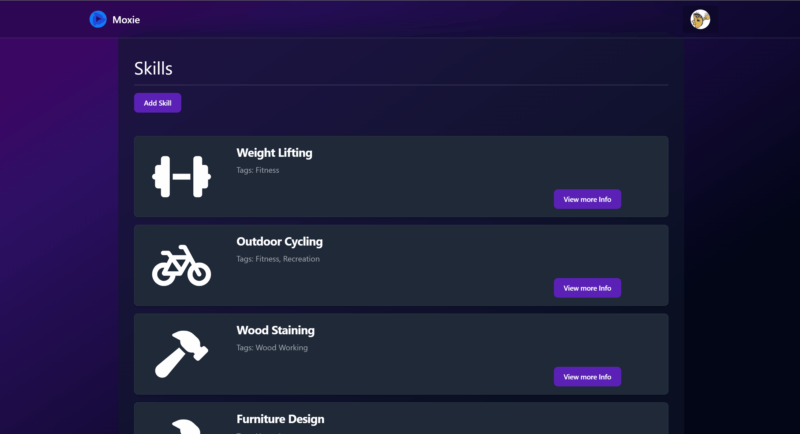

# Moxie



Moxie is a personal dashboard that allows users to track and level up their skills and hobbies. 

This project was created as a Full Stack Capstone project while attending Nashville Software School's Full Stack Web Development Bootcamp. It was completed with one week of planning and 3.5 weeks of coding. The majority of work took place in Summer 2023.
## Table of Contents

- [Moxie](#moxie)
  - [Table of Contents](#table-of-contents)
  - [Project Description](#project-description)
  - [Technologies Used](#technologies-used)
    - [Technologies I had no previous experience with:](#technologies-i-had-no-previous-experience-with)
    - [Why I chose these technologies](#why-i-chose-these-technologies)
  - [Challenges Faced](#challenges-faced)
  - [Lessons Learned](#lessons-learned)
  - [Current Features](#current-features)
    - [For Authorized Users:](#for-authorized-users)
  - [Possible Future Features](#upcoming-features)
  - [How to Install and Run](#how-to-install-and-run)
  - [Credits](#credits)
  - [Links](#links)

## Project Description

This application was built to solve the problem of managing skills and hobbies. Before starting this app, I thought about my process for learning and maintaining different skills and I recognized some bad patterns: 

- Investing in high caliber equipment too soon.
- Trying something way too challening too quickly.
- Getting frustrated by my apparent lack of progress.

Moxie allows users to log their skills/hobbies, create tags and attach them to skills.

Moxie was designed to eventually have a system of reward. Video games have perfected this system of "do something" > "get rewarded with XP" > "XP gets you cool stuff." I want to bring that same concept to Moxie. Unfortunately, the complexities of getting base functionality working in the Moxie frontend slowed my progress significantly, as described in the [Lessons Learned](#lessons-learned) section.

I still hope to build on this concept in the future and come back to this application with a fresh perspective.

# Screenshots/Gifs

## Adding a skill


### Adding/Editing a Tag


## Technologies Used

<a href="https://reactjs.org/" title="React JS"></a>
<a href="https://nextjs.org/" title="NEXT JS"></a>
<a href="https://www.typescriptlang.org/" title="TypeScript"></a>
<a href="https://tailwindcss.com/" title="Tailwind"></a>
<a href="https://flowbite.com/" title="Flowbite"></a>
<a href="https://www.firebase.com/" title="Firebase"></a>
<a href="https://www.npmjs.com/" title="npm"></a>
<a href="https://learn.microsoft.com/en-us/dotnet/csharp/" title="C#"></a>
<a href="https://dotnet.microsoft.com/en-us/" title=".NET"></a>
<a href="https://www.microsoft.com/en-us/sql-server" title="SQL Server"></a>
<a href="https://swagger.io/" title="Swagger"></a>
<a href="https://www.postman.com/" title="Postman"></a>

### Technologies I had no previous experience with:
- NEXTJS
- Typescript

### Why I chose these technologies

1. I wanted to experiement with NEXTJS and understand how to take advantage of that framework's SSG and SSR features. The ease of Vercel hosting is also a plus.
2. I have really enjoyed the strongly typed nature of C# and I wanted to bring a strongly typed approach to the frontend.
3. I've used TailwindCSS and flowbite components in other projects. A side goal of mine is to build reusable react components with these technologies as the foundation.
4. This was an ambitious project, and firebase provided an extremely simple setup for handling authentication.
5. C#/.NET/SQL Server are the backend technologies I was most familiar with and using this stack allowed me keep a high velocity in my backend issues.


## Challenges Faced

One challenge I faced was handling authorized vs. unauthorized routes in NEXTJS. My former experience with ReactRouter was very straightfoward for conditionally rendering routes for different user roles/situations. But I struggled with implementing similar behaviors with my NEXTJS app. The Node server running and delivering the components for each route doesn't know the exact state of the client side logged in user. I implemented an imperfect cookie solution, but there is definitely much more improvement needed here.

One challange I took on that I really enjoyed was creating my own ORM-like API by using inheritance, interfaces, generic types, and C# Attributes. The combination of these tools allowed me to create dynamic methods for CRUD operations that lived in a base repo class. Other classes could inherit from this base, which allowed for very fast expansion of the backend API.

## Lessons Learned

I was naive using NEXTJS with no prior experience and expecting I could use the same exact patterns as React Router. When I realized that I needed to treat authorized and unauthorized routes differently than I was used to, I should've followed the patterns laid out by NEXTJS, instead of trying to come up with my own patterns/flow. The result was an auth flow that is **overly complicated, buggy, and hard to grok.** 

The time I spent forcing NEXTJS into a pattern it wasn't designed for would've been much better spent creating features and completing other tickets. Because of my refusal to adapt, the scope of what I was able to accomplish within the timeframe for this project was significantly narrowed, and some of the authentication is still rather _buggy._

## Current Features

### For Authorized Users:

- Users can create a user profile.
- Users can create, add, update, and delete skills.
- Users can manage their own tags that they can use to organize their skills.
- Users can view skill details.

## Upcoming Features

- Deploying Moxie
- Users can create activity logs that generate XP.
- Users can set goals and assign rewards when certain goals are met.
- Users can create specific challenges to try to beat.
- Users can track and improve teqhniques that relate to a skill.
- Users can keep track of gear that they can use for their skills.
- Integrating charts and graphs for a user's skills so a user can track their progress.

## How to Install and Run

Dependencies
You will need npm, Visual Studio, .NET 6, SQL Server, and whatever SQL Client you prefer (We used SQL Server Management Studio)

1. git clone this repo to your local machine.
2. Setup Firebase project for authentication. For step-by-step instructions for this process, check out this file <a href="/firebaseInstructions.md">here.</a>
3. Navigate to the repo on your machine and run the following commands in the terminal:

```
cd Moxie-Client
cp .sample.env .env.local

```

4. Update the `.env.local` file with the Firebase API keys created in the previous step.
5. Make sure that Node.js and npm are installed on your machine. <a href="https://docs.npmjs.com/downloading-and-installing-node-js-and-npm">Click here for installation.</a>
6. Run the following command in the terminal from the `Moxie-Client` directory:

```
npm install
```

7. Open your SQL Server and copy the SQL script located in `MoxieApi/Database` Directory
8. Paste the script into your SQL client and run. This will create the database and schema

9.In Visual Studio, open the `MoxieApi.sln`
10. Right click on the `Dependencies` folder and select `Reload`
11. Right click on the `MoxieApi` project in the Solution Explorer and select `Manage User Secrets`
12. Fill in the following JSON data, with the location of your database server.

```
{
  "ConnectionStrings": {
    "DefaultConnection": "server=<YourLocalSQLServerDatabaseConnection>;integrated security=true;Trust Server Certificate=true"
  },
}
```
13. Run the Backend from Visual Studio
14. Run the Frontend by navigating to the `Moxie-Client` folder and running `npm run dev`
15. The frontend should start on `http://localhost:3000/`

16. Enjoy the App!

## Credits

I want to thank everyone in my NSS Cohort that helped me out with this project. The instructors gave me meaningful insight into what would be best to focus on in this application.

## Links

<a href="https://dbdiagram.io/d/6466bacfdca9fb07c45bdc8e" target="_blank">Project ERD</a> || <a href="https://excalidraw.com/#json=oGjPAW7fQ59qyYQycoGZ7,L1nBLzmG_FhC5OPVNGY9Dg" target="_blank">Wireframe</a>
